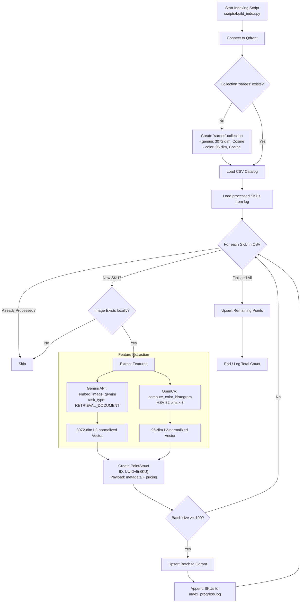
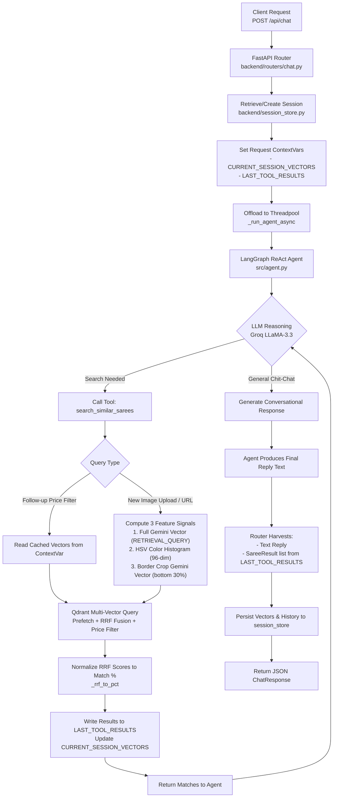
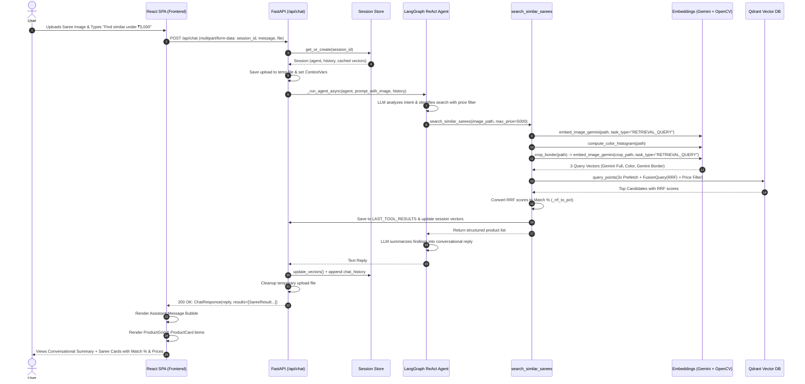

# TailorTalk Flow Documentation

This document outlines the architecture, pipelines, and data flows in the TailorTalk Visual Saree Search project. It details the catalog ingestion and indexing pipeline, the FastAPI and LangGraph ReAct agent request pipeline, and the end-to-end user interaction flow.

---

## 1. Ingestion / Indexing Pipeline

The indexing pipeline processes the saree product catalog, extracts multi-modal and color feature representations, and stores them in a Qdrant vector database for fast similarity retrieval.

**Key Steps:**
1. **Catalog Loading & Deduplication:** Reads product metadata from `data/byrappa_tejas_31july.csv`, strips whitespace, drops invalid rows, and deduplicates by `image_url`.
2. **Resumable Progress Tracking:** Checks `data/index_progress.log` to skip already indexed SKUs, enabling robust restarts without redundant API calls.
3. **Feature Extraction (per saree image `data/images/{sku}.jpg`):**
   - **Semantic Embedding (Gemini):** Computes a 3072-dimensional vector using Google GenAI `models/gemini-embedding-2-preview` with the `RETRIEVAL_DOCUMENT` task type, followed by L2 normalization.
   - **Color Histogram (OpenCV):** Computes a 96-dimensional vector representing the HSV color distribution (3 channels × 32 bins), L2-normalized.
4. **Vector Database Ingestion:**
   - Generates deterministic point IDs using UUIDv5 derived from the SKU (`uuid.uuid5(uuid.NAMESPACE_OID, sku)`).
   - Batches points (chunk size = 100) and upserts them into the Qdrant `sarees` collection with named vectors (`gemini`, `color`) and metadata payload (`sku`, `name`, `retail_price`, `discounted_price`, `image_url`, `product_url`, `in_stock`).
   - Appends processed SKUs to `index_progress.log`.

---

## 2. Agent & Backend Request Pipeline

TailorTalk operates a production-grade **FastAPI** backend with asynchronous request handling, request-scoped context variables, a thread-safe in-memory session store, and a **LangGraph ReAct agent** powered by Groq (`llama-3.3-70b-versatile`).

**Key Steps:**
1. **API Endpoint (`POST /api/chat`):** Receives `multipart/form-data` containing `session_id`, `message`, and optional `image` file or `image_url`.
2. **Session Store & Context Isolation:**
   - Retrieves or initializes session state in `backend/session_store.py` (lazy agent instantiation, conversation history, cached query vectors, TTL eviction).
   - Injects cached session vectors and empty result containers into request-local context variables (`CURRENT_SESSION_VECTORS`, `LAST_TOOL_RESULTS`).
3. **Async Agent Execution:** Offloads synchronous LangGraph agent execution to a thread-pool executor (`_run_agent_async`) so the FastAPI event loop remains non-blocking.
4. **Agent Reasoning & Tool Invocation:**
   - Groq LLM evaluates conversation history and user input.
   - For general queries, it generates a conversational reply without calling tools.
   - For visual search queries, it calls the `search_similar_sarees` tool:
     - **New Image Query:** Downloads URL or reads uploaded file, extracts 3 feature signals (Full Gemini embedding, HSV Color Histogram, and Border/Pallu crop Gemini embedding with `RETRIEVAL_QUERY`), and executes a 3-signal prefetch search in Qdrant with Reciprocal Rank Fusion (RRF).
     - **Follow-up Filter Query (e.g., "under ₹3000"):** Re-uses cached vectors from `CURRENT_SESSION_VECTORS` without re-embedding, applying Qdrant `FieldCondition` range filters on `discounted_price`.
5. **State Persistence & Response Formatting:**
   - Harvests tool results and updated vectors from `contextvars`.
   - Persists updated vectors and appended chat messages into `session_store`.
   - Returns structured `ChatResponse` containing the text `reply` and an array of `SareeResult` objects.

---

## 3. End-to-End User Flow (React + FastAPI)

This flow illustrates the user journey from uploading a saree photo in the React SPA to viewing conversational advice and interactive product cards.

**Key Steps:**
1. **User Interaction (Frontend):** The user accesses the React 18 SPA (`frontend/`), opens the Image Studio sidebar, drops a saree image (or pastes a URL), and types a request (e.g., *"Find me something like this under ₹5,000"*).
2. **HTTP Request:** The `useChat` hook sends a `multipart/form-data` POST request to `/api/chat` containing the `session_id`, text prompt, and image file.
3. **Backend Processing:**
   - FastAPI saves the image to a temporary file, adds context guidance to the prompt, and passes it to the ReAct agent.
   - The agent invokes `search_similar_sarees`, which performs multi-vector extraction and executes 3-signal RRF retrieval against Qdrant.
   - The agent summarizes the matches in natural language, while raw product records are packaged into the JSON payload.
4. **Interactive UI Rendering:**
   - React updates the chat transcript with the assistant's message bubble (rendered with markdown).
   - Below the message, React renders a responsive `ProductGrid` containing `ProductCard` components featuring product imagery, title, match percentage badge, price comparison with retail strikethrough, and a direct link to the boutique store.

---

