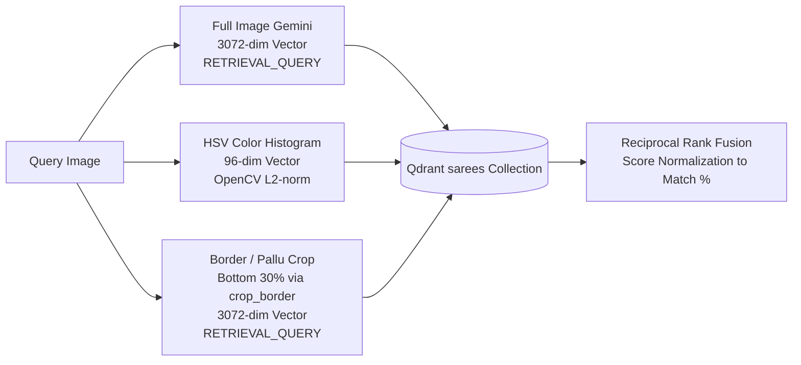

# Search Quality Architecture in TailorTalk

Achieving high-quality search results in a fine-grained domain like sarees—where every product shares the same basic category and silhouette—requires moving beyond simple single-vector embedding retrieval. A generic embedding model frequently struggles with fine nuances in color tone, fabric weave, and intricate border/pallu patterns, resulting in visually inconsistent or loose matches.

To ensure that retrieved sarees closely align with the user's query in color, texture, weave, and pattern design, TailorTalk implements a **3-Signal Multi-Vector Fusion** strategy powered by **Qdrant's Reciprocal Rank Fusion (RRF)**.

---

## 1. Multi-Vector Feature Extraction

Instead of relying on a single embedding vector, the system computes three specialized feature representations for every query:



### A. Semantic & Structural Embeddings (Gemini)
- **Model:** Google GenAI `models/gemini-embedding-2-preview`
- **Dimensionality:** 3072-dim vector, strictly L2-normalized.
- **Task Type Asymmetry:**
  - `RETRIEVAL_DOCUMENT`: Used during catalog ingestion (`scripts/build_index.py`).
  - `RETRIEVAL_QUERY`: Used during live search queries (`src/embeddings.py`, `src/qdrant_store.py`).
- **Purpose:** Gemini captures high-level garment semantics: fabric drape, weave texture (e.g., Kanjeevaram silk vs. Chanderi cotton vs. Organza), motif styling (floral, geometric, paisley, temple borders), and overall design aesthetic.
- **Why Task Type Matters:** The embedding model employs specialized projection heads for documents vs. search queries. Enforcing strict task types preserves optimal vector alignment in cosine similarity space.

### B. Deterministic Color Histograms (OpenCV HSV)
- **Algorithm:** Custom OpenCV HSV Histogram (Hue, Saturation, Value).
- **Dimensionality:** 96-dim vector (3 channels × 32 bins), strictly L2-normalized.
- **Purpose:** Deep multimodal neural networks often prioritize structural similarity or contrast patterns over precise color hues (e.g., matching a royal blue saree to a ruby red saree with similar zari work). In ethnic fashion, exact color match is often the user's primary selection criteria. Computing an explicit HSV histogram ensures strict color fidelity.

### C. Targeted Border & Pallu Region Embeddings (3rd Active Signal)
- **Algorithm:** Bottom 30% regional crop (`crop_border` in `src/qdrant_store.py`) embedded via Gemini using `RETRIEVAL_QUERY`.
- **Purpose:** In saree design, the most distinctive distinguishing elements are concentrated in the lower border and the pallu (end piece). Two sarees might have an identical body color (e.g., bottle green), but one has a heavy gold zari temple border while the other has a delicate floral lace border. Extracting a focused border embedding enables the retrieval engine to capture fine-grained border motifs.
- **Body Crop Provision:** The codebase also includes `crop_body` (top 70% regional crop) for isolated body pattern analysis.

---

## 2. Reciprocal Rank Fusion (RRF) with 3 Prefetch Streams

Extracting multiple vector representations requires an effective fusion strategy. TailorTalk executes a multi-stream prefetch query in Qdrant and merges the candidate lists using database-side Reciprocal Rank Fusion.

### Prefetch Pipeline in Qdrant:
```python
prefetches = [
    Prefetch(query=gemini_vec,        using="gemini", limit=50, filter=qdrant_filter),
    Prefetch(query=color_vec,         using="color",  limit=50, filter=qdrant_filter),
    Prefetch(query=gemini_border_vec, using="gemini", limit=50, filter=qdrant_filter),
]
response = qdrant.query_points(
    collection_name="sarees",
    prefetch=prefetches,
    query=FusionQuery(fusion=Fusion.RRF),
    limit=20,
)
```

### Why 3-Signal RRF Outperforms Single/Dual-Vector Search:
1. **Consensus Ranking:** RRF scores items based on their reciprocal rank positions across all prefetch streams ($Score_{RRF} = \sum \frac{1}{k + rank_i}$). For an item to place at the top of the final results, it must achieve high rankings across global semantics, color distribution, and border detail.
2. **Eliminates False Positives:** A saree with identical color but completely mismatched pattern is penalized by the Gemini streams. Conversely, a saree with matching pattern but completely different color is penalized by the color histogram stream.
3. **Robust to Scaling Differences:** RRF operates purely on rank ordering rather than raw distance scores, preventing high-dimensional embeddings (3072-dim) from drowning out lower-dimensional color histograms (96-dim).

### Score Normalization to User-Facing Match %:
Raw RRF fusion scores are non-intuitive for shoppers. TailorTalk normalizes the scores relative to the top candidate using `_rrf_to_pct`:
$$\text{Match \%} = \min\left(99.9, \left(\frac{\text{score}}{\text{best\_score}}\right) \times 95.0\right)$$
This pins the top match to ~95% and provides proportional, clear match differentiation for subsequent candidates.

---

## 3. Conversational Filtering & Session-Isolated Caching

Users frequently refine visual searches conversationally (e.g., *"Show me cheaper options"* or *"Only sarees under ₹4,000"*).

- **Session Vector Caching:** When an image query is executed, its computed feature vectors (`gemini`, `color`, `gemini_border`) are persisted in `backend/session_store.py`.
- **Zero-Latency Re-Embedding:** Follow-up conversational turns reuse the cached vectors directly, eliminating redundant Gemini API calls and image processing overhead.
- **In-Database Price Filtering:** Price constraints (`min_price`, `max_price`) extracted by the LLM agent are passed directly into Qdrant's `FieldCondition` range filter on `discounted_price` during prefetch execution.
- **Thread-Safe Session Isolation:** Per-session storage ensures that concurrent users never interfere with or overwrite each other's search state.

---

## 4. Production Resilience & Rate Limiting

1. **Exponential Backoff:** The Gemini API client in `src/embeddings.py` implements exponential backoff retry logic (up to 5 retries with progressive delay) to handle transient rate limits (`429`, `RESOURCE_EXHAUSTED`, `Quota exceeded`).
2. **MIME-Type & Format Validation:** Image downloads from external URLs validate HTTP headers and convert images to RGB JPEG before feature computation, preventing encoding discrepancies.
3. **Data Integrity:** Indexing scripts drop duplicate URLs, validate image dimensions (> 0px) and file sizes (> 1 KB), and verify image files with Pillow before indexing.
